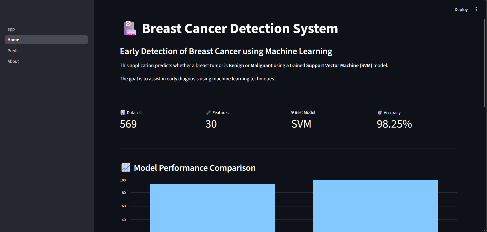
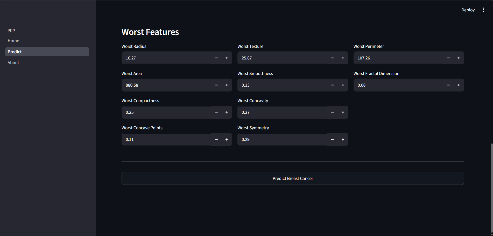
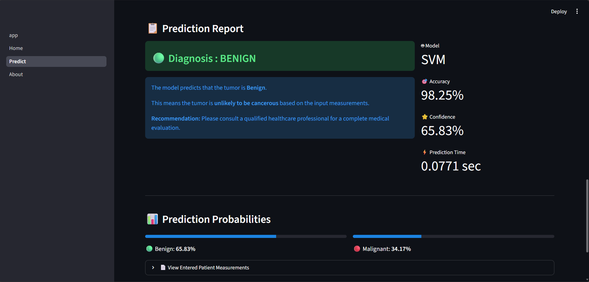
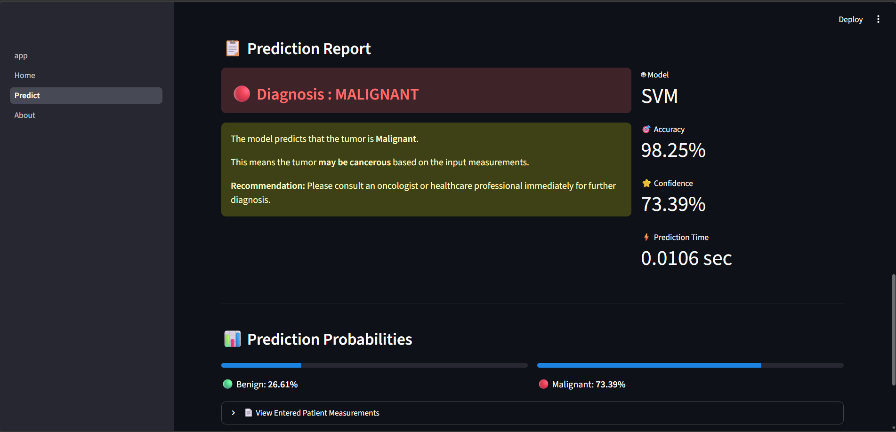
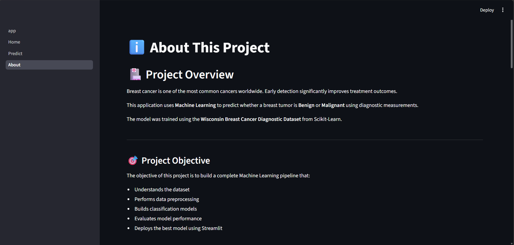

# 🏥 Breast Cancer Detection using Machine Learning

An end-to-end **Machine Learning** project that predicts whether a breast tumor is **Benign** or **Malignant** using a **Support Vector Machine (SVM)** classifier. The project covers the complete ML lifecycle—from data understanding and preprocessing to model training, evaluation, and deployment with **Streamlit**.

---

## 🌟 Features

- 📊 Data Understanding & Exploration
- 🧹 Data Preprocessing
- 📈 Exploratory Data Analysis (EDA)
- 🤖 Support Vector Machine (SVM)
- 🌳 Decision Tree Classifier
- 📏 Feature Scaling with StandardScaler
- 📋 Model Evaluation & Comparison
- 💾 Model Serialization using Joblib
- 🖥️ Interactive Multi-Page Streamlit Application
- 📊 Prediction Confidence Score
- 📑 Modular Python Project Structure

---

## 🛠️ Tech Stack

| Category | Technologies |
|----------|--------------|
| Programming | Python |
| Data Analysis | Pandas, NumPy |
| Machine Learning | Scikit-learn |
| Visualization | Matplotlib, Seaborn |
| Web App | Streamlit |
| Model Saving | Joblib |

---

# 📸 Application Screenshots

## 🏠 Home Page



---

## 🔬 Prediction Page



---

## 🟢 Benign Prediction



---

## 🔴 Malignant Prediction



---

## ℹ️ About Page



---

# 📂 Project Structure

```text
Breast-Cancer-Detection-ML/
│
├── assets/
├── data/
│   ├── raw/
│   └── processed/
│
├── models/
│
├── notebooks/
│   ├── 01_Data_Understanding.ipynb
│   ├── 02_EDA.ipynb
│   ├── 03_Model_Building.ipynb
│   └── 04_Model_Evaluation.ipynb
│
├── outputs/
│
├── pages/
│   ├── 1_Home.py
│   ├── 2_Predict.py
│   └── 3_About.py
│
├── src/
│   ├── config.py
│   ├── logger.py
│   ├── data_preprocessing.py
│   ├── svm_model.py
│   ├── decision_tree.py
│   ├── evaluation.py
│   ├── train.py
│   └── predict.py
│
├── app.py
├── requirements.txt
├── README.md
└── .gitignore
```

---

# ⚙️ Machine Learning Workflow

1. Load Breast Cancer Dataset
2. Perform Data Understanding
3. Data Cleaning & Preprocessing
4. Feature Scaling using StandardScaler
5. Train-Test Split
6. Train Support Vector Machine
7. Train Decision Tree Classifier
8. Evaluate Models
9. Compare Model Performance
10. Deploy Best Model using Streamlit

---

# 📊 Model Performance

| Model | Accuracy | Precision | Recall | F1 Score |
|-------|----------|-----------|--------|----------|
| Support Vector Machine | **98.25%** | **98.61%** | **98.61%** | **98.61%** |
| Decision Tree | 92.10% | 95.65% | 91.67% | 93.62% |

### 🏆 Best Performing Model

**Support Vector Machine (SVM)** was selected for deployment because it achieved the highest overall performance on the test dataset.

---

# ▶️ Installation

## Clone Repository

```bash
git clone https://github.com/hritwikrupesh/Breast-Cancer-Detection-ML.git
```

## Navigate to Project

```bash
cd Breast-Cancer-Detection-ML
```

## Create Virtual Environment

```bash
python -m venv venv
```

## Activate Virtual Environment

### Windows

```bash
venv\Scripts\activate
```

### Linux / macOS

```bash
source venv/bin/activate
```

## Install Dependencies

```bash
pip install -r requirements.txt
```

## Launch Streamlit App

```bash
streamlit run app.py
```

---

# 🎯 Prediction Output

The application predicts:

- 🟢 Benign
- 🔴 Malignant

along with:

- Confidence Score
- Prediction Time
- Prediction Probability
- Entered Patient Measurements

---

# 🚀 Future Improvements

- Explainable AI using SHAP/LIME
- Deep Learning Model
- XGBoost Classifier
- REST API
- Docker Containerization
- Cloud Deployment
- Electronic Health Record (EHR) Integration

---

# 👨‍💻 Author

**Hritwik Rupesh Gollu**

Computer Science Engineering Student

Interested in Machine Learning, Data Analytics, Python, and Cloud Technologies.

---

⭐ If you found this project useful, consider giving it a star!